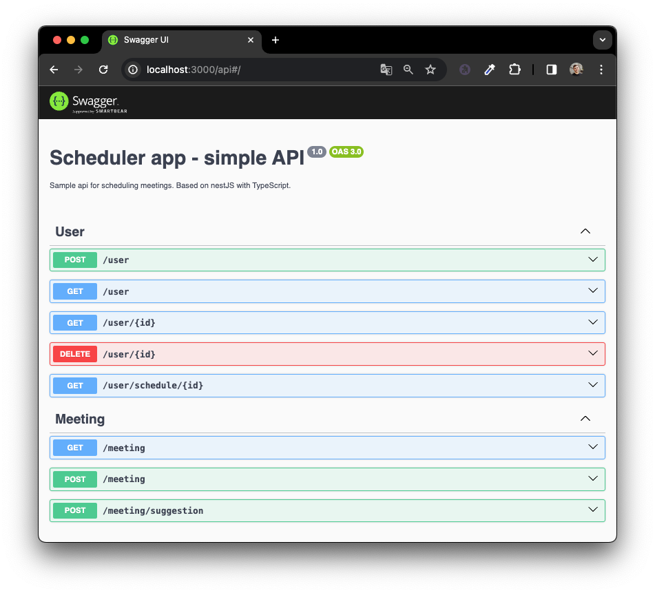

## Description

Sample api for scheduling meetings. Based on nestJS with TypeScript.


## Demo

<div style="text-align:center;">
    
</div>

## Used technologies

  
  
  


## Installation

```bash
$ npm install
```

## Running the app

```bash
# development
$ npm run start

# watch mode
$ npm run start:dev

# production mode
$ npm run start:prod
```

## Test

```bash
# unit tests
$ npm run test

# e2e tests
$ npm run test:e2e

# test coverage
$ npm run test:cov
```

## Author

- [@AdrianWii](https://www.github.com/AdrianWii)
